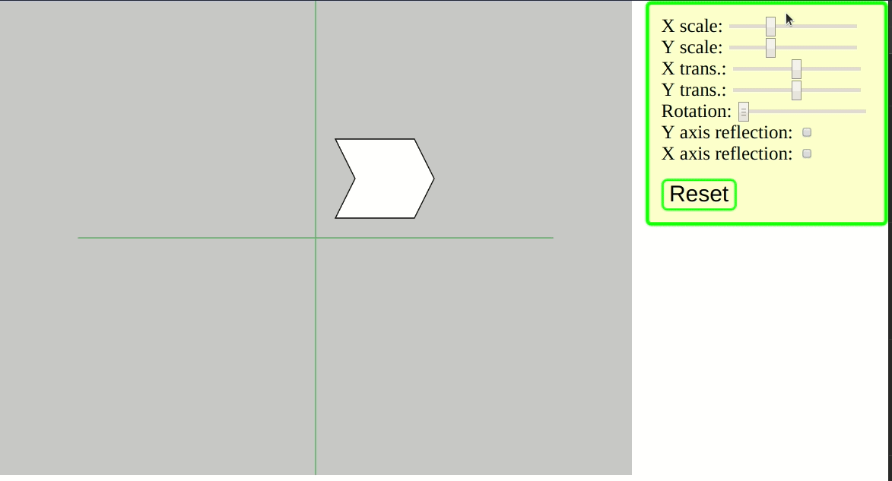

# Linear Transformations

This piece of code shows how to transform shapes using the concept of linear transformation and matrices.

## How to execute
- Open the file `index.html` in your favorite browser;
OR
- Execute `yarn install` then `yarn start`.  